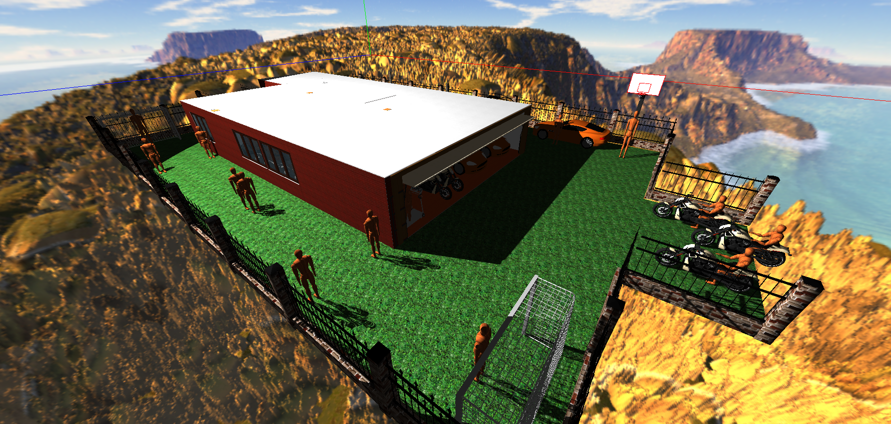

# SUNCG Visulization 
This is a light-weight tool of visualizing [SUNCG][SUNCGGITHUB] dataset, based on [three.js][threejs]. 



# Dependencies

# To Use
This tool can be used as easy as a single click! Just be careful of the following: 
## Preparing GLTF Models
SUNCG is originally based on .ojb/.mtl format. However, there are some problems of using the OBJLoader of three.js, so currently we should use a script to transform models into gltf-based ones. I would be really grateful if anyone figures out how to correctly use OBJLoader, and the details of the problem is specified [here][objloader]. 

To use [OBJ2GLTF][objgltf], node.js is required to install firstly. Then install the package: 
```
npm install -g obj2gltf
```

There are two lines of code we should modify before transforming:
```
const data_dir = 'D:/suncg/';
const house_id = 'b6ef8e1b68ff811454eda42d81ce2c62';
```
The first line is the root directory of suncg dataset, which is expected to be organized exactly same as the released suncg dataset. The second line is the id of house, which is one of the list in .../suncg/house/. The results are saved with the same directory of the script. See the current [demo](https://github.com/Shao-Kui/SUNCG-Visulization-Using-Three.js/tree/master/scenes). 
## Specifying IDs
Fortunately, there is only one line of code that we just need specify the house id in main.html after transforming the models. 
```
const house_id = '00e2eed27fb6b5c911624902888039ee';
```
## Avoiding CORS
Since no server is required i.e.,only a single html file is needed to configurate and open, common issues could occur especially [CORS](https://en.wikipedia.org/wiki/Cross-origin_resource_sharing). Note to disable web security and allow files access: 
```
chrome.exe --disable-web-security --allow-file-access-from-files
```
I have merely tested it on chrome, so please tell me if other browsers encounter issues. 

# Still Under Working... ... ...
A demo is uploaded, a first glance of this tool is available. 

# Copyright
This tool is for research ONLY, which is NOT for any commercial usage! The skybox is from [http://www.custommapmakers.org][skybox]. 

[threejs]:https://threejs.org
[skybox]:http://www.custommapmakers.org/skyboxes.php
[SUNCGGITHUB]:https://github.com/shurans/SUNCGtoolbox
[objgltf]:https://github.com/AnalyticalGraphicsInc/obj2gltf
[objloader]:https://stackoverflow.com/questions/54906697/three-js-can-not-load-texture-for-mtl-obj-files-parts-with-image-textures-are
